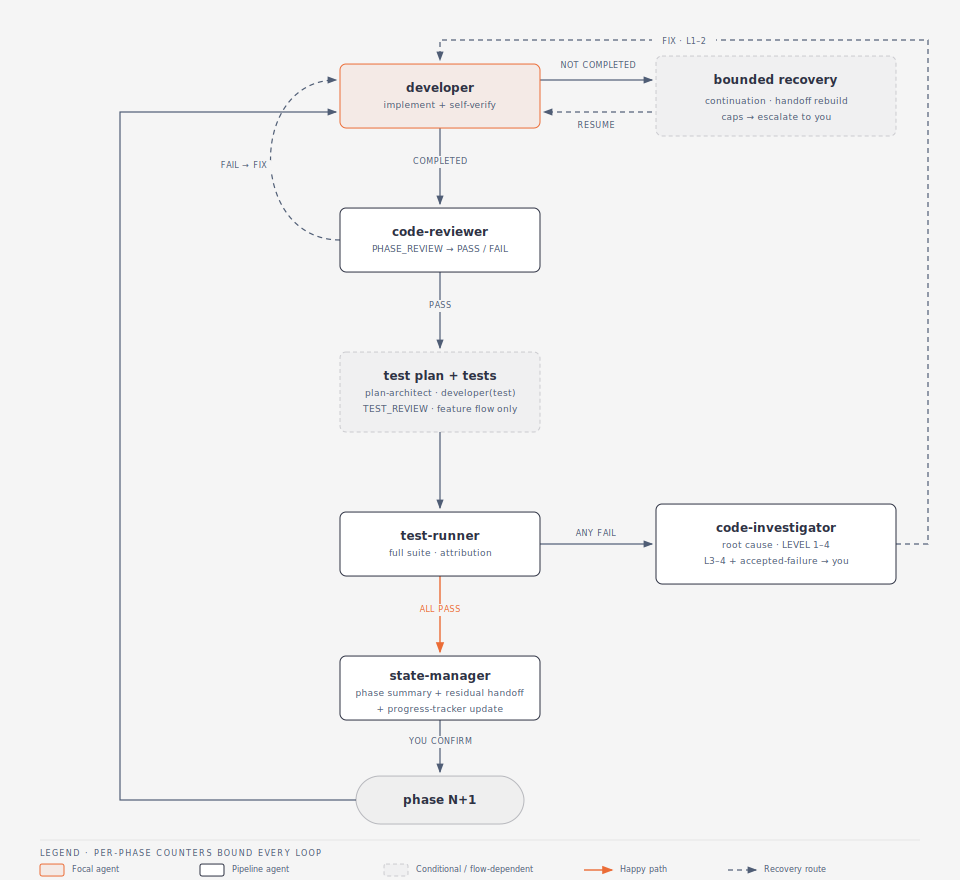
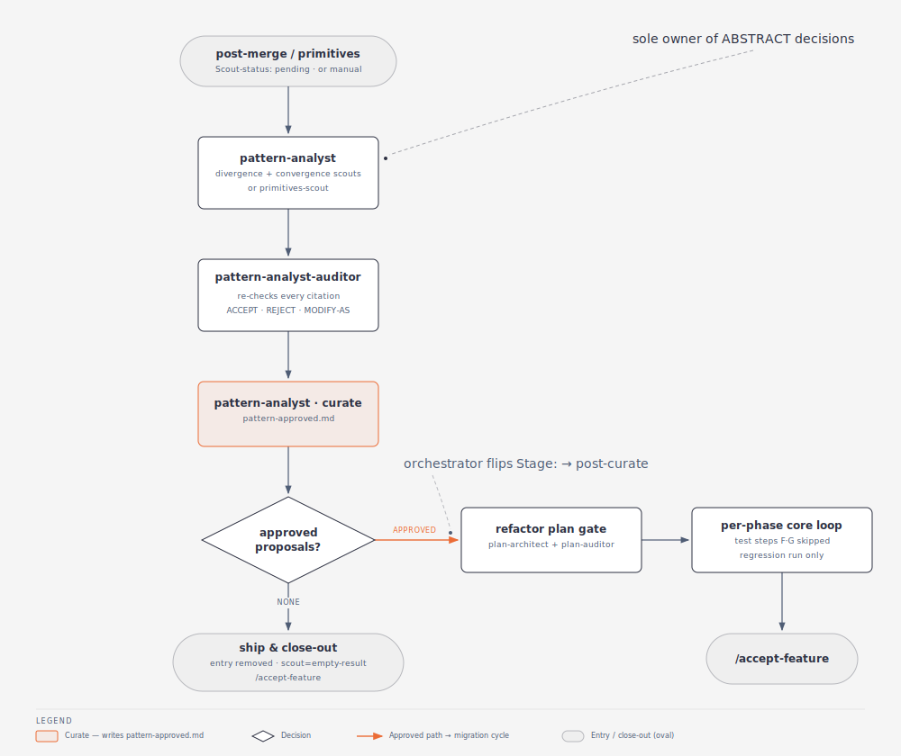
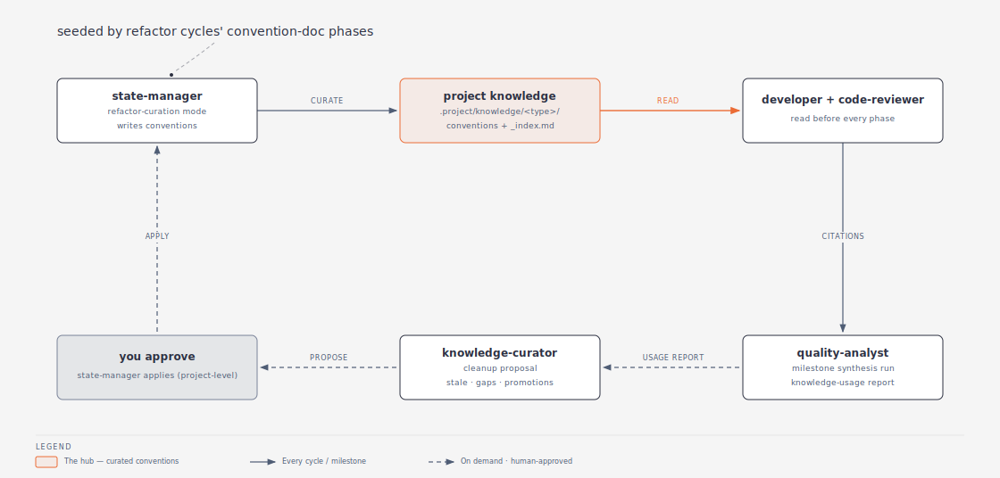
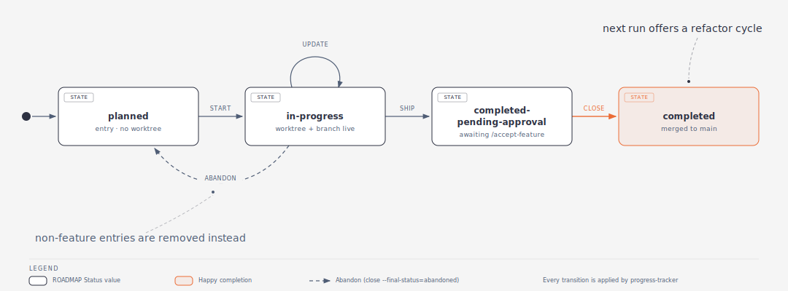

# Agentic Development Pipeline

A multi-agent system that takes a product from idea → specified → designed → planned → implemented → tested → reviewed → merged → archived. Interactive **skills** co-author documents with you; headless **agents** execute and verify; a central **orchestrator** runs every flow inside an isolated git worktree and merges only on your approval.

This README is a **map of the whole system** — the happy paths and the major recovery paths, not every rule inside every agent. For exact inputs/outputs, read the agent's interface contract (`~/.claude/agents/interface-contracts/<name>.contract.md`).

---

## 1. The system at a glance


**The engine inside EXECUTE — every phase of every cycle runs through this loop:**



An in-depth explanation of this loop — the step table, recovery routing, and counters — lives in [§7.3 The per-phase core loop](#73-the-per-phase-core-loop).

Six stages, each owned by a skill you invoke:

| Stage | Skill | Produces |
|---|---|---|
| **DEFINE** | `/product-architect` | VISION + PRD; ROADMAP authored via `progress-tracker` |
| **GOVERN** | `/tech-stack-architect` | Tech Stack Charter + TDRs — the approved-tech allowlist |
| **SPECIFY** | `/spec-architect` | SRS + BDD scenarios for one feature |
| **DESIGN** | `/design-architect` | SDD — the architectural decisions |
| **EXECUTE** | `/orchestrator` | plan → build → test → review, automated in a worktree |
| **ACCEPT** | `/accept-feature` | atomic `--no-ff` merge to main; milestone archive when due |

Everything between `/orchestrator` and `/accept-feature` is automated: the orchestrator dispatches headless agents (`plan-architect`, `developer`, `code-reviewer`, `test-runner`, `code-investigator`, `state-manager`, `progress-tracker`, …) and pauses only at phase boundaries and escalations.

### The loops that drive it

1. **Plan gate** (§7.2) — every plan is authored by `plan-architect` and validated by `plan-auditor`; `INVALID` loops back for an update, capped at 3 audits per gate, then escalates to you.
2. **Per-phase build loop** (§7.3) — `developer` implements → `code-reviewer` reviews → tests are planned, written, and run → every failure gets a root cause from `code-investigator` → `state-manager` distills a handoff. Repeats for each phase; every recovery path is counted and capped.
3. **Lifecycle loop** (§12) — each ROADMAP entry moves `planned → in-progress → completed-pending-approval → completed`, every transition applied by `progress-tracker`.
4. **Refactor loop** (§9) — merging a feature marks it `Scout-status: pending`; the next orchestrator run scouts the new code for refactor opportunities, adversarially audits the findings, and migrates the approved ones in their own cycle.
5. **Knowledge loop** (§10) — refactor cycles curate convention docs that `developer`/`code-reviewer` read every phase; milestones measure which conventions actually get cited; `knowledge-curator` proposes pruning the dead weight.

Two artifacts are the spine the rest of the pipeline reads:

- **The ROADMAP** — `product-architect` defines milestones and backlog and hands them to `progress-tracker`, which authors and owns the file (one narrow carve-out: the orchestrator itself flips a refactor/primitives entry's `Stage:` line, §9).
- **The Tech Stack Charter** — seeded once by `/tech-stack-architect create`, maintained on demand. The allowlist that gates which technologies SPECIFY/DESIGN/EXECUTE may adopt.

**The shortest happy path:**

```
/product-architect                       # one-time: vision, PRD, ROADMAP
/tech-stack-architect                    # one-time: seed the Tech Stack Charter (create mode)
/spec-architect <feature>                # SRS + BDD for one feature
/design-architect <feature>              # SDD (architectural decisions)
/orchestrator <feature>                  # plan → build → test → review (auto)
/accept-feature <feature>                # merge to main; archive milestone if last
```

On demand: `/orchestrator` with no argument auto-discovers the next work item from the ROADMAP (`in-progress` → pending post-merge refactor → `planned`; bugfix entries are never auto-picked). `/orchestrator bug fix <description>` runs the bug-fix flow (§7.5). `/tech-stack-architect` recurs whenever a feature needs off-charter technology (`update`/`swap`/`unblock`).

---

## 2. Two kinds of building blocks

| | **Skills** (you invoke) | **Agents** (auto-dispatched) |
|---|---|---|
| How it runs | `/command` in your session, interactive | Spawned as a subagent, headless |
| Talks to you? | Yes — asks questions, waits for confirmation | No — returns a structured message to its caller |
| Examples | `product-architect`, `tech-stack-architect`, `spec-architect`, `design-architect`, `orchestrator`, `accept-feature`, `abandon-feature` | `plan-architect`, `developer`, `code-reviewer`, `test-runner`, `code-investigator`, `state-manager`, `progress-tracker`, `pattern-analyst`, `quality-analyst`, the auditors |

**Rule of thumb:** the *architects* (product / tech-stack / spec / design) are interactive **skills** that co-author documents with you. The *auditors*, *executors*, and *bookkeepers* are headless **agents** the pipeline dispatches for you. The **orchestrator** is the skill you invoke to turn specs into merged code; it dispatches all the execution agents. A third tier of **helper skills** (`commit-to-git`, `bash-usage`, `create-folder`, `find-subagent-contract`, `context-curation`, `use-pipeline-scripts`) is loaded by the agents themselves (§14).

---

## 3. DEFINE — `/product-architect`

Turns a product idea into structured product documents through staged questioning. Defines the **what/why**, never the **how**.

- **Output:** `.project/product/VISION.md`, `.project/product/PRD.md` — written directly. The ROADMAP is handed to `progress-tracker` (`init` mode), which authors `.project/product/ROADMAP.md`.
- Covers vision, users, requirements (`REQ-#`, P0/P1/P2), feature decomposition, non-goals, metrics, constraints, launch plan, roadmap. Confirms before every write and before dispatching the ROADMAP hand-off.
- **Update mode** re-questions only the areas you want to change.
- Decomposes requirements into **named features** — these populate the ROADMAP's per-milestone backlog that the rest of the pipeline executes one at a time.

---

## 4. GOVERN — `/tech-stack-architect`

Owns the project's **Tech Stack Charter** — the authoritative allowlist of approved frameworks, libraries, and services — plus an append-only log of **Technology Decision Records (TDRs)**. It **decides and records**; it never writes application code, specs, designs, or plans, and never runs installs. The implementation that realizes a decision flows back through the normal spec → design → plan → developer pipeline.

- **Modes** (`create | update | consult | swap | unblock`) — `create` is auto-selected when no charter exists yet; once a charter is present, the skill asks you to pick among the other four:
  - **`create`** (greenfield, one-time) — reads the PRD/specs and `package.json` files, derives the required categories, and co-authors the charter with you decision-by-decision. Consequential tech (frameworks, external services, anything touching auth/payments/storage/crypto, the build/test toolchain) each gets a full TDR; minor deps are confirmed in one batch.
  - **`update` / `swap`** — amend the charter: add/remove/upgrade a dependency or cross a major version (`update`), or replace an approved component (`swap` — impact analysis, supersedes the old TDR).
  - **`unblock`** — intake a `BLOCKED` escalation from `plan-architect` or a `developer` that needs an unapproved technology; research, decide, amend, then tell you to re-run the blocked step.
  - **`consult`** — read-only Q&A; writes nothing.
- **Output:** `.project/knowledge/tech-stack/charter.md` + `tdr/TDR-NNN-<slug>.md`, written only after a STOP & WAIT confirmation. Both are **main-canonical** (same class as the ROADMAP) — downstream consumers read them from main even while a worktree is live.
- **Enforcement is downstream, not here:** `design-auditor` rejects off-charter tech in the SDD, `plan-auditor` rejects it in the plan, and `plan-architect`/`developer` escalate `BLOCKED` rather than adopt unapproved tech — that escalation returns here via `unblock`.
- **Worktree guard (warn-and-confirm):** before amending, it lists active worktrees and requires explicit confirmation when the change touches a category an in-flight worktree depends on.

---

## 5. SPECIFY — `/spec-architect`  (+ optional `spec-auditor`)

Turns one feature into precise, implementable specs.

- **Input:** `/spec-architect [feature-name]` — with no argument it reads the ROADMAP, buckets features by spec state on disk, and lets you pick. When specs already exist it offers regenerate / amend / resume (multi-session resume via an in-file status marker).
- **Output:** `SRS.md` (requirements as `FR-#` / `NFR-#`) plus `bdd/CONTEXT.md` and `bdd/*.feature` files in `.project/cycles/DD-MM-YYYY-<feature>/specs/`.
- Explores the codebase first (via the `Explore` subagent) so questions are grounded in existing patterns. Tracks coverage across topic areas scoped to the layers the feature touches. Rewrites vague answers into technical precision and flags ambiguities.
- The ROADMAP is **read-only** to this skill — spec existence on disk is the source of truth.

**Optional gate — `spec-auditor`:** validates SRS/BDD structure, requirement IDs, Gherkin syntax, SRS↔BDD traceability, and content quality (vague-language detection). Returns `VALID`/`INVALID`, writes and self-commits an attempt-numbered report, and refuses to audit while an active worktree exists for the feature. Run it before moving on.

---

## 6. DESIGN — `/design-architect`  (+ optional `design-auditor`)

Guides interactive architectural decisions, producing a Software Design Document (SDD). The SDD captures **how / which approach** — not the requirements (SRS) and not the step-by-step (plan).

- **Input:** `/design-architect [feature-name]` (requires SRS + BDD to exist) — with no argument it runs ROADMAP-driven discovery (ready / has-SDD / blocked); when an SDD exists it offers regenerate / amend.
- **Output:** `SDD.md` in the feature's `specs/`
- Presents 2–3 options **with a recommendation** for each decision (`DD-#`), grounded in codebase evidence and preferring reuse over new infrastructure. Every decision traces to `FR-#` with SRS line numbers. New dependencies/infra get flagged for your explicit approval inside the SDD.

**Optional gate — `design-auditor`:** validates SDD structure, SRS↔SDD traceability (exact `FR-#` matching), code-reference existence, and internal consistency. Same self-committed report + worktree-refusal behavior as `spec-auditor`.

---

## 7. EXECUTE — `/orchestrator`  (the heart of the pipeline)

```
/orchestrator [feature-name | primitives | bug fix <description>] [resume | restart]
```

The orchestrator coordinates execution end-to-end across **four flows**: feature, refactor, primitives, and bug-fix. It is **execution-only**: it never writes specs or designs (one carve-out: the bug-fix flow's `bug-report.md`, §7.5), and it dispatches `plan-architect` to create a plan if one is missing. It runs every flow inside an isolated worktree and keeps its own context lean — it passes file *paths* between agents and never reads report bodies into its own context.

### 7.1 Startup — discover work, claim a worktree

Read ROADMAP → pick the next work item by priority → `git worktree add .worktrees/<slug>/` on a `<slug>` branch from `origin/main` → `progress-tracker start` → install deps, copy `.env`, then plan or pre-curate.

- **Work discovery** classifies every ROADMAP entry and picks by priority: `in-progress` > a completed feature with `Scout-status: pending` > `planned`. Bugfix entries are excluded — they run only via an explicit `bug fix` invocation. It cross-checks `git worktree list` and surfaces stale state (ROADMAP says in-progress but no worktree → tells you to `/abandon-feature`) or orphan worktrees.
- **Worktree isolation:** specs and main's plan are **frozen** for the duration; the worktree's copies are its own until merge.
- **Soft-transactional start:** `git worktree add` and `progress-tracker start` succeed or fail together. If `start` fails, the worktree is rolled back.
- `resume` continues an interrupted run from worktree-local state; `restart` calls `/abandon-feature` first, then starts fresh (`restart` doesn't apply to primitives — always a fresh dated invocation).

### 7.2 Pre-flight — create and validate the plan (feature flows)

If `plans/implementation-plan.md` already exists, it's used directly. If only specs exist, the orchestrator runs **two plan gates in sequence**, each a `plan-architect` → `plan-auditor` loop:

1. **Draft gate** — `plan-architect` writes `implementation-plan-draft.md`; `plan-auditor` validates it (verbs, concerns, metadata, phase sizing, paths).
2. **Final gate** — only after the draft is `VALID`, `plan-architect` derives `implementation-plan.md`; `plan-auditor` re-validates (two-pass diff vs. the draft, REUSE/EXTRACT/ABSTRACT checks).

On `INVALID`, `plan-architect` updates and the gate re-audits — **3 total audits per gate** (1 original + up to 2 update cycles), then it escalates to you. If `plan-architect` returns `Status: ERROR` (e.g. `TECH_NOT_IN_CHARTER`), the gate stops immediately — no audit, no retry — and waits for you (off-charter tech routes to `/tech-stack-architect unblock`). Both agents **self-commit** their artifacts; the orchestrator only computes `total-phases` and reports open questions, then waits for your "go".

There is always **one plan per feature**, containing **Phase 1..N**. N falls out of enforced sizing rules (effort budget ≤8 points, ≤6 tasks, ≤15 files per phase, boundaries on developer-type change), not a complexity guess — `plan-auditor` enforces them.

### 7.3 The per-phase core loop

For each phase 1..N the orchestrator runs this loop. Counters reset every phase; the phase-start commit is captured for clean reverts.


| Step | Actor | Purpose |
|---|---|---|
| B | **developer** | Implements the phase tasks. Self-verifies (lint/build) with up to 2 internal fix attempts. Returns `COMPLETED` / `PARTIAL` / `BLOCKED`. |
| C | orchestrator | Routes the developer's status (§7.4). |
| D | **code-reviewer** | `PHASE_REVIEW` (or `ABSTRACT_MIGRATION_REVIEW`). Read-only; returns `PASS`/`FAIL` with findings tagged Severity × Category. |
| E | orchestrator | On `FAIL`, consult **diagnostic-routing** (§7.4). |
| F | **plan-architect** + **plan-auditor** | Create & validate a per-phase test plan. *Feature flows only.* |
| G | **developer** (test) + **code-reviewer** | Write tests, then `TEST_REVIEW`. *Feature flows only.* |
| H | **test-runner** → **code-investigator** | Run tests (`PASS`/`FAIL`/`BLOCKED` if the command itself errors); **every** failure is investigated for true root cause. |
| I | orchestrator + **state-manager** | Orchestrator writes & commits the phase orchestration summary; `state-manager` distills a write-once phase summary + residual-only handoff (and `cycle-close` on the last phase); `progress-tracker update` records progress. |
| J/K | orchestrator | Report, wait for your confirmation, advance. |

**Refactor / primitives variant:** Steps F and G are skipped — no new behavior, so existing tests cover correctness; `test-runner` runs only to catch regressions. A **convention-doc-only** phase skips B/D/F/G/H and runs only `state-manager` (`refactor-curation`) + `progress-tracker update`.

### 7.4 Major error & recovery handling

The loop has bounded recovery at every joint; when a per-phase counter is exceeded, it **escalates to you** with history and a specific question.

**Developer didn't return COMPLETED:**

| Return | Meaning | Orchestrator response |
|---|---|---|
| `PARTIAL` | Turn limit, scope larger than estimated, a partial build failure, or a transient environment issue. Work is committed; remainder captured in a *residual artifact*. | Spawn a **continuation developer** pointed at the residual artifact (a transient issue is instead retried once). Cap: 3 `PARTIAL`s per phase (max 2 continuations) → escalate, plan miscalibration suspected. |
| `BLOCKED: handoff-insufficient` | Plan is fine, but the handoff lacks prior-phase context. | Dispatch **state-manager `rebuild`**, re-dispatch developer. Cap: 2 rebuilds → escalate. |
| `BLOCKED: spec-ambiguous` | Plan/spec is wrong or contradictory. | Pause, present to you; route to **plan-architect update**. (Bug-fix flow instead re-investigates deeper, §7.5.) |
| `BLOCKED: dependency-missing` / `environment-broken` | External blocker. | Pause; you resolve, then re-run. An unapproved dependency points you to `/tech-stack-architect unblock`. |
| `COMPLETED` + deviations | Developer made a NOTIFY-level deviation. | **plan-architect (`deviation` target)** decides `PROCEED_NEXT` vs `RETRY_PHASE`. |

**Code review FAILed (diagnostic-routing):** the orchestrator decides whether to investigate or fix directly, from the findings' Category × Severity:

- **Always investigate** (spawn `code-investigator`): any `CRITICAL`; `LOGIC`/`INTEGRATION` at `ERROR`; any `SECURITY` (phase reviews).
- **Direct to developer:** `CONVENTION` (any), `TYPE` warnings.
- **Conditional:** `VALIDATION`/`TYPE` errors go to the developer first; investigate if the same category fails twice — or immediately when a conditional category has 3+ findings (volume override). `TEST_REVIEW` failures use their own, slightly narrower routing table.

**code-investigator verdicts (investigation-routing):** progressive depth (0 = failing files → 3 = full plan):

| Verdict | Meaning | Action |
|---|---|---|
| `LEVEL_1` | Local fix | Hand the investigation file to the developer; re-review. |
| `LEVEL_2` | Cross-phase fix | Same, plus blast-radius warning; re-review all touched files. |
| `LEVEL_3` | Plan deviation | **Pause, escalate to you** with options → resolution → plan update → phase restarts with fresh counters. |
| `LEVEL_4` | Architectural / ambiguous | **Pause, escalate to you** with competing hypotheses. |
| `ACCEPTED_FAILURE` | Test-failure only: the failure is expected (unimplemented/deferred behavior), after ruling out both code and test bugs. | **Ask you:** confirm → `test.skip` with inline reason + re-run; reject → re-investigate as a code/test bug. |

**Per-phase counters (reset each phase; exceeding any → escalate):** implementation attempts (3), test-write attempts (3), code-bug fixes (2), test-bug fixes (2), handoff rebuilds (2), partial continuations (3). Interrupted or malformed agent returns get **one idempotent re-dispatch** via the `Commit:` field convention (§15), then escalate.

### 7.5 The bug-fix flow

```
/orchestrator bug fix <description>        # resume later with: /orchestrator bug fix
```

A reproduce-first flow with its own ROADMAP entry type (`Type: bugfix`, slug `<DD-MM-YYYY>-fix-<name>`):

1. **Stage 0 — intake.** The orchestrator authors and commits `specs/bug-report.md` (the flow's specification — the only spec it ever writes) and claims a worktree.
2. **Stage 1 — reproduce & diagnose.** Behavioral bugs: a reproduction test plan (`plan-architect`, `bugfix-reproduction` target) → a test developer writes the failing test → `test-runner` (reproduction mode — **red is success**) → `code-investigator` finds the root cause. Build/lint/type bugs skip the test machinery: `code-investigator` (`STANDALONE_BUG`) is both oracle and diagnostician. `repro_attempts` caps the red-confirmation cycle at 3 (persisted across resume). `CANNOT_REPRODUCE` parks the cycle blocked, worktree kept.
3. **Checkpoint.** `LEVEL_1`/`LEVEL_2` at high confidence auto-proceeds; `LEVEL_3`/`LEVEL_4` or medium confidence pauses for your decision.
4. **Stage 2 — plan.** Two-pass plan gates (`bugfix-draft` → `bugfix-final`), as §7.2.
5. **Stage 3 — fix.** The per-phase core loop with F/G skipped; `code-reviewer` checks the fix's fidelity to the investigation (masking a symptom is `CRITICAL`); green gates require every reproduction test green plus the suite green. `spec-ambiguous` re-investigates deeper instead of waiting on you.
6. **Stage 4 — ship** → `/accept-feature <slug>` as usual.

### 7.6 Feature completion

After the last phase clears the loop (`state-manager cycle-close` already ran inside that phase's Step I): `progress-tracker ship` (Status → `completed-pending-approval`) → optional reviews → hand to you for `/accept-feature`.

- **CYCLE_REVIEW** — cross-phase code review catching inconsistencies per-phase review misses.
- **INTEGRATION_VERIFICATION** — structural wiring check (orphan exports, stubs, unwired artifacts). Both are optional and opt-in.

---

## 8. ACCEPT / ABANDON — closing a cycle

### `/accept-feature [slug | path]`

Promotes a `completed-pending-approval` cycle — feature, refactor, primitives, or bugfix — to `completed` and integrates it: confirm → `git merge --no-ff <branch>` into main (the atomic integration point) → `progress-tracker close` (flips ROADMAP Status, deletes the tracking file, detects milestone boundaries) → worktree + branch cleanup.

- The merge is the integration point; the skill never edits the worktree's tree.
- `progress-tracker close` is the **only** actor that detects a milestone boundary. When the just-closed entry was the last in its milestone, it signals `MilestoneCompleted: v<X.Y>` — accept-feature relays this as a follow-up instruction for the **main agent**, which then runs: (1) the `quality-analyst` fan-out — one scoped run per (cycle × target) across the milestone's cycles, then one `synthesis` run with milestone scope, which also writes the knowledge-usage report — and (2) `milestone-archivist` (§11).
- Idempotent and safe to re-run; a conflict on `ROADMAP.md`/tracking files always resolves to main's version.

### `/abandon-feature [slug]`

Escape hatch for an in-progress cycle. Confirms (destructive; skipped when invoked programmatically with a recorded reason — which is how `/orchestrator restart` uses it), removes the worktree + branch **without merging**, then `progress-tracker close --final-status=abandoned`.

- **Feature:** specs/plan on main are preserved; the entry reverts to `planned` so the feature can restart.
- **Refactor:** re-queues (parent's `Scout-status` → `pending`). **Primitives / bugfix:** the entry is removed entirely — a bugfix's cycle directory exists only in the worktree pre-accept, so nothing survives; re-attempt with a fresh `bug fix` invocation.
- **Orphan worktrees** (no matching ROADMAP entry, e.g. after a failed transactional rollback) get a type-agnostic teardown with `close` skipped.

---

## 9. POST-MERGE — scout-and-refactor & primitives

Once a feature is merged, its ROADMAP entry is marked `Scout-status: pending`. The next `/orchestrator` run offers a **post-merge refactor cycle** that hunts for refactor opportunities the new code created. A separate **primitives** cycle (`/orchestrator primitives`, manual) proposes shared utilities when multiple accepted features need the same thing.



Both run in their own worktree and produce findings under `.project/cycles/<slug>/refactor-proposals/`. A scout-and-refactor cycle uses a single unified slug — `<DD-MM-YYYY>-refactor-from-<parent-name>` — for every artifact, with a `Stage: pre-curate | post-curate` field on the ROADMAP entry (primitives entries carry it too, informationally).

- **Detection directives:** `REUSE` (feature reimplemented something inline), `EXTRACT` (duplicated cluster → new util), `CREATE` (new shared primitive), `ABSTRACT` (generalize a narrow util), plus `REMOVE`/`RELOCATE`. `pattern-analyst` is the **sole owner of ABSTRACT decisions** across the whole pipeline.
- **The auditor is adversarial:** it re-checks every citation against HEAD and **re-applies the ABSTRACT decision matrix** itself rather than trusting the finding's verdict. `MODIFY-AS` = one-field fixable by curate; `REJECT` = structural defect, final.
- **Approved proposals exist:** the **orchestrator itself** mutates main's ROADMAP `Stage:` line to `post-curate` under the mkdir-lock — the single carve-out from `progress-tracker`'s exclusive ownership — then runs the refactor-plan gate and the core loop (F/G skipped).
- **No proposals:** the findings bundle is committed, `progress-tracker ship` closes out with `Stage: pre-curate` preserved, and `/accept-feature` reads that Stage to route the close — the refactor entry is **removed** and the parent's `Scout-status` becomes `empty-result`.
- **ABSTRACT migration phases** follow a T1–T5 spine: rewrite signature → author codemod + tests → run codemod → build → manual stragglers. `code-reviewer` runs `ABSTRACT_MIGRATION_REVIEW` and checks the codemod's modified-file count against the approved finding's call-site data.

---

## 10. The knowledge loop — `.project/knowledge/` conventions

The pipeline accumulates and curates its own project knowledge so future developers and reviewers get sharper context over time.



- `state-manager` (`refactor-curation`) is the writer of convention files (`.project/knowledge/<type>/*.md` + `_index.md` routing rows).
- `developer` and `code-reviewer` read `architecture.md` / `overview.md` / `sitemap.md` plus per-type `_index.md` + conventions before every run; code-reviewer tags each finding with a `Suggested knowledge source`.
- At milestone close, the `quality-analyst` fan-out's **milestone-scope synthesis run** writes the dated knowledge-usage report — presence/frequency of cited sources, no judgement.
- `knowledge-curator` reasons about **absence/dead-weight** and proposes cleanup (stale conventions, gaps, overlap, or promotion to a user-level skill). It is **not** orchestrator-dispatched — you or the main agent run it; it only proposes. On your approval, `state-manager` applies the **project-level** items (user-level items, like skill promotions, are applied outside it).

---

## 11. Quality & milestone archival

**`quality-analyst`** — pure observer; reads the execution record, never touches code (it does write and self-commit its own reports — worktree-side for cycle-scoped runs, main-side for milestone synthesis). Three modes:

| Mode | Unit | Output |
|---|---|---|
| `agent` / `skill` | One target (an agent or skill) × one cycle | Scoped analysis report bounded to that target's responsibility surface |
| `synthesis` (cycle scope) | One cycle's scoped reports | Cycle roll-up with cross-target correlation |
| `synthesis` (milestone scope) | A milestone's scoped reports | Milestone roll-up **+ the dual-axis knowledge-usage report** |

There is no monolithic "analyze everything" mode — whole-cycle or milestone analysis is composed by the **dispatcher** (the main agent) fanning out scoped runs, guided by each run's `Signals-Dropped:` return field.

**`milestone-archivist`** — dispatched by the main agent (on accept-feature's `MilestoneCompleted` follow-up, after the quality fan-out). Creates the immutable `.project/product/releases/v<X.Y>/` (snapshots ROADMAP + PRD, synthesizes `CHANGELOG.md` from feature summaries), commits path-scoped, and creates an annotated `v<X.Y>` tag, pushed to origin best-effort. Refuses to overwrite an existing archive.

---

## 12. Feature lifecycle & the ROADMAP

`progress-tracker` owns `.project/product/ROADMAP.md` and the per-slug tracking files — it creates the ROADMAP (`init`, dispatched by `product-architect`) and applies every lifecycle transition, always writing to main behind an mkdir-lock (the orchestrator's `Stage:` flip in §9 is the single carve-out). This single-owner rule is what makes the ROADMAP merge-safe.



| Status | Set by | Via |
|---|---|---|
| `planned` | progress-tracker `start` | dated `### <slug>` entry created without a worktree (`init` seeds the backlog itself — backlog items carry no slug entry yet); also restored by an abandon |
| `in-progress` | progress-tracker `start` | orchestrator at worktree claim (creates or transitions the entry directly to in-progress) |
| `completed-pending-approval` | progress-tracker `ship` | orchestrator after the last phase |
| `completed` | progress-tracker `close` | `/accept-feature` |
| *(abandon)* | progress-tracker `close --final-status=abandoned` | `/abandon-feature` — not a Status value: a feature entry reverts to `planned`; refactor/primitives/bugfix entries are removed |

ROADMAP entries are `### <slug>` headings (with `Type: feature|refactor|primitives|bugfix`, `Status`, `Scout-status`, `Stage` where applicable, …) grouped under `## Milestone: v<X.Y>` sections. `progress-tracker` modes: `init` / `start` / `update` / `ship` / `close`.

---

## 13. Artifacts on disk

```
.project/
├── product/                        direction + release history
│   ├── VISION.md  PRD.md           product identity + the "bible"  (product-architect)
│   ├── ROADMAP.md                  the spine                    (progress-tracker — owner)
│   ├── cycles-in-progress/<slug>.md  per-cycle tracking         (progress-tracker)
│   └── releases/v<X.Y>/            immutable archive + CHANGELOG (milestone-archivist)
├── knowledge/                      stable engineering knowledge
│   ├── overview.md  architecture.md  backend.md  frontend.md  sitemap.md
│   ├── domain.md                   product/business domain knowledge
│   ├── operations.md               commands, ports, env, testing, deployment
│   ├── tech-stack/                 charter.md + tdr/TDR-NNN-*.md (tech-stack-architect — sole owner)
│   └── <type>/                     curated conventions + _index (state-manager refactor-curation)
├── cycles/DD-MM-YYYY-<slug>/
│   ├── specs/   SRS.md, SDD.md, bdd/, audit reports — or bug-report.md (bugfix)
│   ├── plans/   implementation-plan.md / refactor-plan.md / reproduction + bugfix plans,
│   │            test-plans/, plan-audit/
│   ├── codemods/                    ABSTRACT migration scripts   (developer)
│   ├── refactor-proposals/          pattern-findings, pattern-audit, pattern-approved
│   └── execution/
│       ├── developer-reports/       per-phase reports + .runs/ archives
│       ├── code-reviews/            per-phase / cycle / integration reviews
│       ├── code-investigations/  test-results/   (code-investigator; test-runner)
│       ├── orchestration-summaries/ per-phase observability (orchestrator-written)
│       ├── state/                   phase-summaries/, handoffs-to-developer/, execution-index.md, cycle-summary.md
│       └── .orchestrator-state.md   intra-phase resume
└── pipeline/                       AI-process machinery (project-scoped)
    ├── quality-reports/             scoped + synthesis + knowledge-usage reports (quality-analyst)
    ├── knowledge-cleanup-proposals/ cleanup proposals                   (knowledge-curator)
    └── scripts/                     committed pipeline tooling (inventory-utils.ts, curate-approved.ts, codemods/)
```

---

## 14. The full cast

**Skills (you invoke):**

| Skill | Role |
|---|---|
| `product-architect` | Vision, PRD (+ ROADMAP via progress-tracker) |
| `tech-stack-architect` | Owns the Tech Stack Charter + TDRs (create / update / swap / unblock / consult) |
| `spec-architect` | SRS + BDD for a feature |
| `design-architect` | SDD (architectural decisions) |
| `orchestrator` | Run feature / refactor / primitives / bug-fix flows end-to-end |
| `accept-feature` | Merge a completed cycle to main; relay milestone follow-up |
| `abandon-feature` | Discard an in-progress cycle |
| `agent-architect` / `domain-architect` | Build/maintain the pipeline's own agents, skills, and domains (meta) |

**Agents (dispatched):**

| Agent | Role | Key outputs |
|---|---|---|
| `plan-architect` | Authors plans: feature (draft/final), per-phase test, refactor, bugfix (reproduction/draft/final), deviation updates | plan files (self-committed) |
| `plan-auditor` | Validates plan structure & code refs per target | `VALID`/`INVALID` + report |
| `developer` | Implements phases (backend/frontend/infra/test personas); self-verifies | code + report (`COMPLETED`/`PARTIAL`/`BLOCKED`) |
| `code-reviewer` | 6 modes: PHASE / VERIFICATION_FAILURE / TEST / CYCLE / INTEGRATION / ABSTRACT_MIGRATION | `PASS`/`FAIL` + findings (Severity × Category) |
| `test-runner` | Runs the suite, preliminary fault attribution | results + `CODE_BUG`/`TEST_BUG`/`UNCLEAR` |
| `code-investigator` | Root cause (depth 0–3) + resolution mode | `LEVEL_1–4` / `ACCEPTED_FAILURE` / `CANNOT_REPRODUCE` + investigation file |
| `state-manager` | Distills summaries/handoffs; curates conventions (cycle-phase / cycle-close / rebuild / refactor-curation) | phase summaries, handoffs, cycle-summary, conventions |
| `progress-tracker` | ROADMAP + tracking owner — creation & transitions (init/start/update/ship/close) | ROADMAP & tracking-file mutations |
| `pattern-analyst` | Detects refactor opportunities; owns ABSTRACT (4 modes) | findings + `pattern-approved.md` |
| `pattern-analyst-auditor` | Adversarially re-verifies every finding | `pattern-audit.md` (ACCEPT/REJECT/MODIFY-AS) |
| `quality-analyst` | Scoped quality analysis (agent/skill × cycle) + synthesis roll-ups | scoped, synthesis & knowledge-usage reports |
| `knowledge-curator` | Proposes knowledge cleanup (consumer-agnostic) | cleanup proposal |
| `milestone-archivist` | Immutable milestone archive + git tag | `.project/product/releases/v<X.Y>/`, `v<X.Y>` tag |
| `spec-auditor` / `design-auditor` | Optional spec/design quality gates | `VALID`/`INVALID` + self-committed report |
| `agent-auditor` / `domain-auditor` | Validate agents/skills/domains (meta) | advisory review reports |

**Helper skills (agent-loaded, not user-invoked):**

| Skill | Used by | Purpose |
|---|---|---|
| `commit-to-git` | every committing agent + the orchestrator | The single source of truth for path-scoped commits with `Agent:` attribution |
| `use-pipeline-scripts` | `pattern-analyst` | Script templates (`inventory-utils.ts`, `find-call-sites.ts`, `curate-approved.ts`) + bootstrap protocol |
| `context-curation` | `state-manager` (refactor-curation) | Authoring discipline for convention files |
| `find-subagent-contract` | any dispatcher | Locating interface contracts before crafting an Agent prompt |
| `bash-usage` / `create-folder` | agents broadly | Bash path discipline; portable directory creation |

---

## 15. Cross-cutting machinery

- **Worktree isolation** — every flow runs in `.worktrees/<slug>/` on its own branch from `origin/main`. Work reaches main only through `/accept-feature`'s atomic `--no-ff` merge. Specs and main's plan are frozen while a worktree is live.
- **Single-owner ROADMAP (one carve-out)** — `progress-tracker` creates the ROADMAP and applies every lifecycle transition, behind an mkdir-lock, always targeting main with path-scoped commits. The sole exception: the orchestrator flips a refactor/primitives entry's `Stage:` line at the curate→plan transition (§9). A merge conflict on those paths always resolves to main.
- **Technology governance** — the **Tech Stack Charter** (`.project/knowledge/tech-stack/`) is the approved-tech allowlist, authored only by `/tech-stack-architect` and main-canonical like the ROADMAP. `design-auditor` and `plan-auditor` reject off-charter technology; `plan-architect`/`developer` escalate `BLOCKED`, which routes back to `/tech-stack-architect unblock`.
- **The `Commit:` convention** — every committing agent returns `Commit: <hash> | skipped | none | failed`. A **missing** field (interrupted return) triggers one idempotent re-dispatch, then escalation. `Commit: failed` is never re-dispatched — the artifact is on disk; the failure needs human eyes.
- **Interface contracts** — `~/.claude/agents/interface-contracts/<name>.contract.md` defines each agent's exact inputs/outputs. The orchestrator reads the contract before dispatching, so it formats requests and parses returns correctly. Index: `interface-contracts/_index.md`.
- **Completion-gate hooks** — a `SubagentStop` hook blocks output-producing agents from returning until their declared output file exists: agents register their target in `/tmp/.claude-agent-output-target`, and a registry (`hooks/output-required-agents.json`) additionally blocks listed agents that never registered at all. A safety valve releases the agent after 2 blocked attempts, so the orchestrator's missing-file recovery (`Commit:` convention) remains the backstop.
- **Context discipline** — the orchestrator passes paths, not contents; reads only the current phase of the plan; never accumulates agent output in its own context. Agents are stateless and read only what they're handed.

---

## 16. Meta-pipeline (building the pipeline itself)

The same architect→auditor pattern builds the pipeline's own components:

```
/agent-architect  ──►  creates/updates an agent or skill (+ contract, guide)  ──►  agent-auditor (advisory)
/domain-architect ──►  creates/updates a domain knowledge pack                ──►  domain-auditor (advisory)
```

Auditors here are **advisory** — they report findings against standards but cannot block creation.

---

## 17. File locations

| What | Where |
|---|---|
| Skills | `~/.claude/skills/<name>/SKILL.md` |
| Developer skills (per dev-type) | `~/.claude/skills/developer-skills/<dev-type>/<skill>/SKILL.md` |
| Agents | `~/.claude/agents/<name>/<name>.md` |
| Interface contracts | `~/.claude/agents/interface-contracts/<name>.contract.md` |
| Component guides | `~/.claude/documentation/<name>.guide.md` |
| These diagrams | `~/.claude/documentation/diagrams/` (`.svg` embedded here, `.html` standalone) |
| Hooks & config | `~/.claude/hooks/`, `~/.claude/settings.json` |
| Product (vision / PRD / roadmap / tracking / releases) | `.project/product/` — `VISION.md`, `PRD.md`, `ROADMAP.md`, `cycles-in-progress/`, `releases/v<X.Y>/` |
| Tech Stack Charter + TDRs | `.project/knowledge/tech-stack/charter.md`, `.project/knowledge/tech-stack/tdr/` |
| Feature artifacts | `.project/cycles/DD-MM-YYYY-<slug>/` |
| Refactor proposals | `.project/cycles/<slug>/refactor-proposals/` |
| Conventions | `.project/knowledge/<type>/` |
| Quality & cleanup reports | `.project/pipeline/quality-reports/`, `.project/pipeline/knowledge-cleanup-proposals/` |
| Milestone archives | `.project/product/releases/v<X.Y>/` |

Dates: `DD-MM-YYYY` in directory names, `DD.MM.YYYY` in review filenames.
